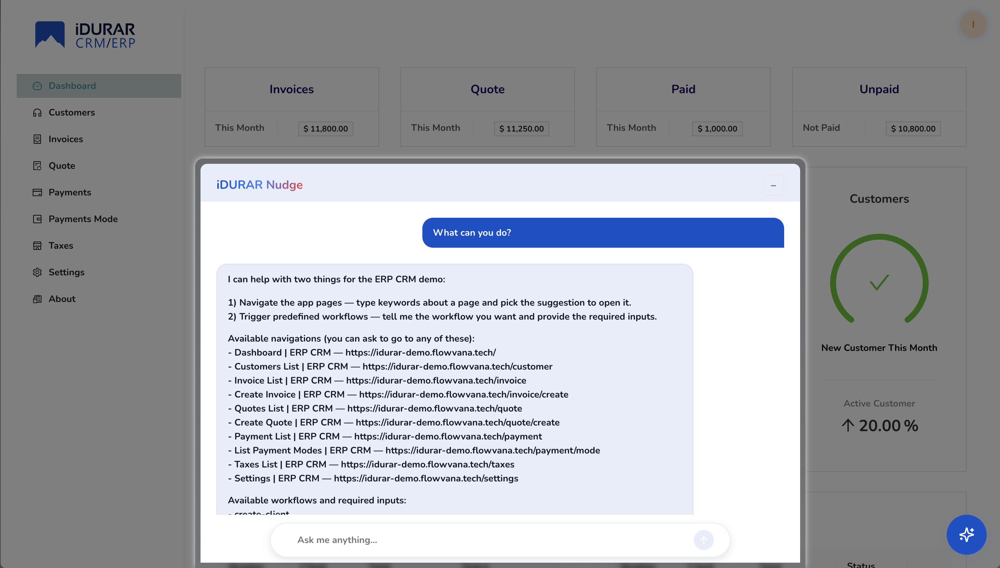

# OpenFlo

# What is OpenFlo?

OpenFlo helps you to build Language User Interfaces(LUI) for your SaaS application. Using OpenFlo, you can build your LUI in hours instead of months. With OpenFlo, you can focus on building your core application logic and the underlying infrastructure.

This project is under active development. A basic version of this project is available at [idurar-demo](https://idurar-demo.flowvana.tech/)

Current features:

- [x] Navigation (Navigate to any page in the app that does not depend on a specific tenant)
- [x] Search Hooks (Searching in any entities & navigation to that entity)
- [x] Workflow execution using with Single API call

Future:
- [] Workflow execution using with multiple API calls
- [] QnA wth documentation

If you have feature suggestions, ideas, or are interested in contributing, feel free to reach out—my DMs are always open.
https://www.linkedin.com/in/vinodtahelyani/
